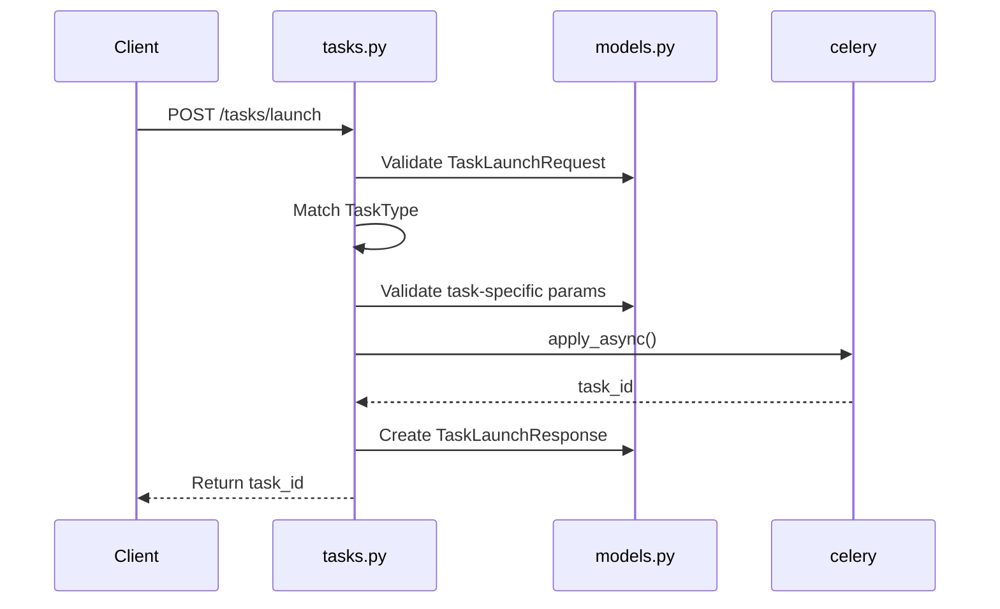
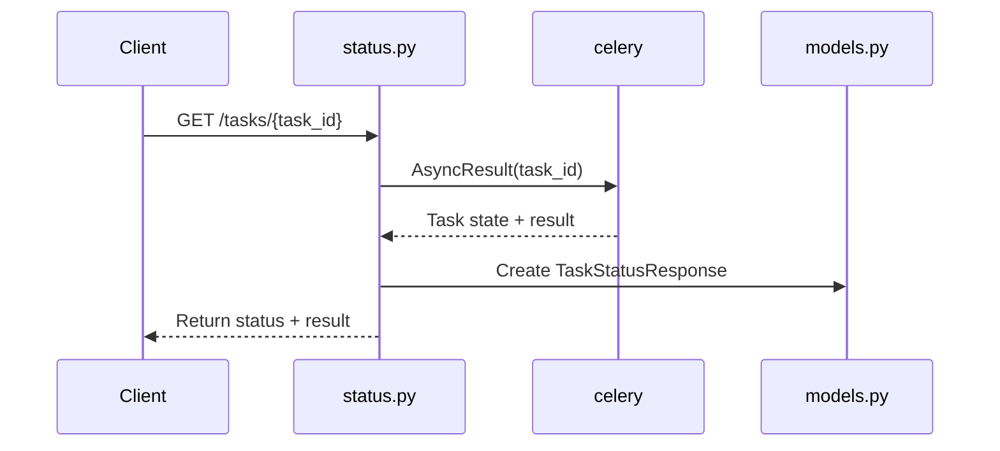
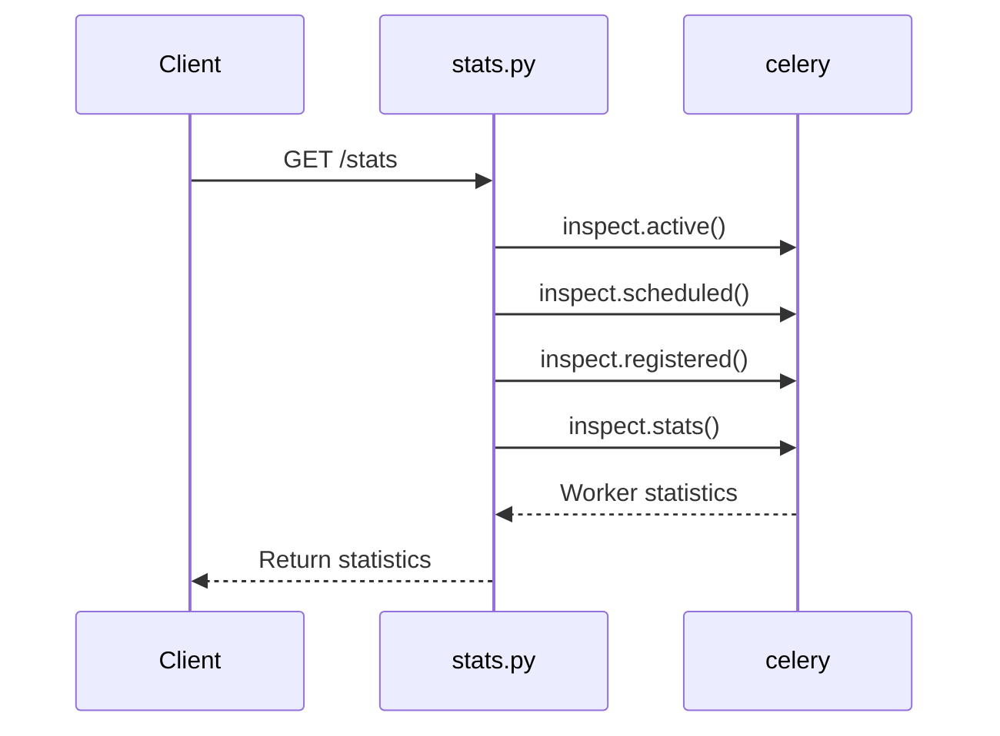

# Celery Router Structure

## Directory Layout

```
backend-v2/app/routers/celery/
├── __init__.py          # Main router combining all sub-routers
├── models.py            # Pydantic models and enums
├── tasks.py             # Task management endpoints
├── status.py            # Status monitoring endpoints
├── stats.py             # Statistics endpoints
├── README.md            # Module documentation
└── STRUCTURE.md         # This file
```

## Module Responsibilities

### `__init__.py` - Main Router
**Purpose:** Combines all sub-routers into a single router

**Exports:**
- `router` - Main APIRouter with prefix `/celery`

**Configuration:**
```python
router = APIRouter(
    prefix="/celery",
    tags=["Celery Tasks"],
)

router.include_router(tasks.router)
router.include_router(status.router)
router.include_router(stats.router)
```

---

### `models.py` - Data Models
**Purpose:** All Pydantic models and enums

**Enums:**
- `TaskType` - Available task types
- `TaskStatus` - Celery task states

**Task Parameters:**
- `SyncDocumentsParams`
- `SyncDocumentsAllParams`
- `SyncF29Params`
- `SyncF29AllParams`

**API Models:**
- `TaskLaunchRequest`
- `TaskLaunchResponse`
- `TaskStatusResponse`
- `AvailableTask`

**Exports:**
```python
__all__ = [
    "TaskType",
    "TaskStatus",
    "SyncDocumentsParams",
    "SyncDocumentsAllParams",
    "SyncF29Params",
    "SyncF29AllParams",
    "TaskLaunchRequest",
    "TaskLaunchResponse",
    "TaskStatusResponse",
    "AvailableTask",
]
```

---

### `tasks.py` - Task Management
**Purpose:** Endpoints for listing and launching tasks

**Endpoints:**
| Method | Path | Description |
|--------|------|-------------|
| GET | `/tasks` | List all available tasks |
| POST | `/tasks/launch` | Launch a new task |

**Dependencies:**
```python
from app.infrastructure.celery.tasks.sii import (
    sync_documents,
    sync_documents_all_companies,
    sync_f29,
    sync_f29_all_companies,
)
```

**Key Functions:**
- `list_available_tasks()` - Returns task catalog
- `launch_task()` - Validates params and launches task

---

### `status.py` - Status Monitoring
**Purpose:** Endpoints for monitoring task execution

**Endpoints:**
| Method | Path | Description |
|--------|------|-------------|
| GET | `/tasks/{task_id}` | Get task status and result |
| DELETE | `/tasks/{task_id}` | Revoke/cancel a task |
| POST | `/tasks/{task_id}/retry` | Retry a failed task |

**Dependencies:**
```python
from app.infrastructure.celery import celery_app
```

**Key Functions:**
- `get_task_status()` - Queries Celery for task state
- `revoke_task()` - Cancels running or pending task
- `retry_task()` - Information about retrying failed tasks

---

### `stats.py` - Statistics
**Purpose:** Endpoints for Celery monitoring

**Endpoints:**
| Method | Path | Description |
|--------|------|-------------|
| GET | `/stats` | Get worker and queue statistics |

**Dependencies:**
```python
from app.infrastructure.celery import celery_app
```

**Key Functions:**
- `get_celery_stats()` - Returns worker stats, active tasks, etc.

---

## API Endpoints Map

```
/api/celery/
├── GET    /tasks                    # List available tasks
├── POST   /tasks/launch             # Launch a task
├── GET    /tasks/{task_id}          # Get task status
├── DELETE /tasks/{task_id}          # Revoke task
├── POST   /tasks/{task_id}/retry    # Retry task
└── GET    /stats                    # Get Celery stats
```

## Data Flow

### Launching a Task



### Checking Task Status



### Getting Statistics



## Import Hierarchy

```
main.py
  └─> routers/__init__.py
        └─> routers/celery/__init__.py
              ├─> routers/celery/tasks.py
              │     └─> routers/celery/models.py
              ├─> routers/celery/status.py
              │     └─> routers/celery/models.py
              └─> routers/celery/stats.py
```

## File Sizes & Complexity

| File | Lines | Purpose | Complexity |
|------|-------|---------|------------|
| `__init__.py` | ~50 | Router composition | Low |
| `models.py` | ~100 | Data models | Low |
| `tasks.py` | ~180 | Task launching | Medium |
| `status.py` | ~160 | Status monitoring | Medium |
| `stats.py` | ~70 | Statistics | Low |

**Total:** ~560 lines of code

## Testing Strategy

### Unit Tests
Each module can be tested independently:

```python
# Test models
from app.routers.celery.models import TaskType, SyncDocumentsParams

def test_sync_documents_params_validation():
    params = SyncDocumentsParams(company_id="123", months=1)
    assert params.months == 1

# Test tasks endpoint
from app.routers.celery.tasks import list_available_tasks

async def test_list_tasks():
    tasks = await list_available_tasks()
    assert len(tasks) > 0
```

### Integration Tests
Test the complete flow:

```python
from fastapi.testclient import TestClient

def test_launch_and_query_task(client: TestClient):
    # Launch task
    response = client.post("/api/celery/tasks/launch", json={
        "task_type": "sii.sync_documents",
        "params": {"company_id": "test"}
    })
    assert response.status_code == 200
    task_id = response.json()["task_id"]

    # Query status
    response = client.get(f"/api/celery/tasks/{task_id}")
    assert response.status_code == 200
```

## Extension Points

### Adding a New Task Type

1. **Add to `TaskType` enum in `models.py`:**
   ```python
   class TaskType(str, Enum):
       # ... existing types
       NEW_TASK = "sii.new_task"
   ```

2. **Add parameter model in `models.py`:**
   ```python
   class NewTaskParams(BaseModel):
       param1: str = Field(...)
       param2: int = Field(1, ge=1)
   ```

3. **Update `list_available_tasks()` in `tasks.py`:**
   ```python
   AvailableTask(
       task_type=TaskType.NEW_TASK.value,
       name="sii.new_task",
       description="Description",
       parameters={...}
   )
   ```

4. **Add dispatch logic in `launch_task()` in `tasks.py`:**
   ```python
   elif request.task_type == TaskType.NEW_TASK:
       params = NewTaskParams(**request.params)
       task_result = new_task.apply_async(kwargs=...)
   ```

### Adding a New Endpoint

Create a new router file if it's a separate concern:

```python
# routers/celery/monitoring.py
from fastapi import APIRouter

router = APIRouter()

@router.get("/health")
async def health_check():
    return {"status": "healthy"}
```

Then include it in `__init__.py`:
```python
from . import monitoring

router.include_router(monitoring.router)
```

## Best Practices

1. **Keep modules focused** - Each file has a single responsibility
2. **Use type hints** - All functions have proper type annotations
3. **Validate at boundaries** - Pydantic models validate all inputs
4. **Log consistently** - Use emojis for easy visual scanning
5. **Handle errors gracefully** - Convert exceptions to proper HTTP errors
6. **Document thoroughly** - Docstrings for all public functions
7. **Test independently** - Each module can be unit tested in isolation
