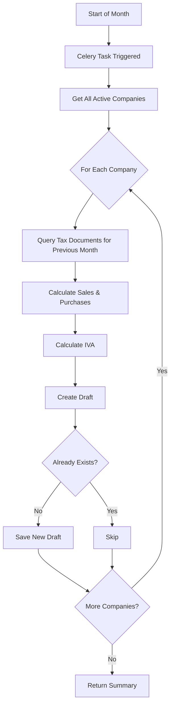

# Form29 Generation System

## Overview

Complete system for automatic generation of Form29 (F29) tax form drafts for all companies in the platform. The system consists of:

1. **Repository layer** - Data access for Form29 entities
2. **Service layer** - Business logic for F29 calculation and draft management
3. **Celery task** - Asynchronous task for batch processing

## Architecture

```
Celery Task (generate_f29_drafts_all_companies)
    ↓
Form29Service (business logic)
    ↓
Form29Repository (data access)
    ↓
Database (Form29 model with draft tracking)
```

## Components

### 1. Form29Repository

**Location:** [backend/app/repositories/tax/form29.py](../app/repositories/tax/form29.py)

Enhanced repository with methods for draft management:

**Key methods:**
- `find_by_period(company_id, year, month, revision_number)` - Find F29 for specific period
- `exists_for_period(company_id, year, month)` - Check if F29 exists
- `get_latest_revision_number(company_id, year, month)` - Get latest revision
- `create_draft(company_id, year, month, user_id, **kwargs)` - Create new draft
- `update_validation(form29_id, status, errors)` - Update validation state
- `confirm_draft(form29_id, user_id, notes)` - Confirm draft for submission
- `get_active_drafts(company_id)` - Get all active drafts

### 2. Form29Service

**Location:** [backend/app/services/form29/](../app/services/form29/)

Business logic layer for Form29 management.

**Key methods:**

#### `calculate_f29_from_documents(company_id, year, month)`
Calculates F29 values from tax documents (DTEs) for a period:
- Sums sales (facturas, boletas, notas de crédito)
- Sums purchases (facturas de compra)
- Calculates IVA to pay, IVA credit, and net IVA

Returns:
```python
{
    "total_sales": Decimal,
    "taxable_sales": Decimal,
    "exempt_sales": Decimal,
    "sales_tax": Decimal,
    "total_purchases": Decimal,
    "taxable_purchases": Decimal,
    "purchases_tax": Decimal,
    "iva_to_pay": Decimal,
    "iva_credit": Decimal,
    "net_iva": Decimal
}
```

#### `create_draft_for_period(company_id, year, month, user_id, auto_calculate)`
Creates a Form29 draft for a specific company and period:
- Checks if draft already exists
- Auto-calculates values from documents if requested
- Creates draft with proper revision number
- Returns tuple `(Form29, is_new: bool)`

#### `validate_draft(form29_id)`
Validates a Form29 draft:
- Checks period is not in future
- Validates all values are non-negative
- Verifies IVA calculations are correct
- Updates validation status in database
- Returns tuple `(is_valid: bool, errors: List[dict])`

#### `confirm_draft(form29_id, user_id, notes)`
Confirms a draft for submission:
- Validates draft first
- Updates status to "confirmed"
- Records who confirmed and when
- Returns updated Form29

#### `create_drafts_for_all_companies(year, month, auto_calculate)`
**Main method** - Creates drafts for all active companies:
- Queries all active companies
- Creates draft for each company
- Auto-calculates values from tax documents
- Handles errors gracefully per company
- Returns summary statistics

Returns:
```python
{
    "period_year": int,
    "period_month": int,
    "total_companies": int,
    "created": int,
    "skipped": int,
    "errors": int,
    "error_details": [
        {
            "company_id": str,
            "company_name": str,
            "error": str
        }
    ]
}
```

### 3. Celery Task

**Location:** [backend/app/infrastructure/celery/tasks/forms/form29.py](../app/infrastructure/celery/tasks/forms/form29.py)

**Task name:** `forms.generate_f29_drafts_all_companies`

Asynchronous task for batch F29 draft generation.

**Parameters:**
- `period_year` (int, optional) - Year for F29 period (defaults to previous month)
- `period_month` (int, optional) - Month for F29 period (1-12, defaults to previous month)
- `auto_calculate` (bool, default=True) - Whether to calculate from tax documents

**Features:**
- Auto-detects previous month if parameters not provided
- Runs service in async context
- Handles database connections properly
- Retries on database/connection errors
- Tracks execution time
- Comprehensive error handling

**Returns:**
```python
{
    "success": bool,
    "period_year": int,
    "period_month": int,
    "total_companies": int,
    "created": int,
    "skipped": int,
    "errors": int,
    "error_details": List[dict],
    "execution_time_seconds": float
}
```

## Usage

### 1. Using the Service Directly (async)

```python
from app.config.database import get_db
from app.services.form29 import Form29Service

async with get_db() as db:
    service = Form29Service(db)

    # Generate drafts for all companies
    summary = await service.create_drafts_for_all_companies(
        period_year=2025,
        period_month=1,
        auto_calculate=True
    )

    print(f"Created: {summary['created']}")
    print(f"Skipped: {summary['skipped']}")
    print(f"Errors: {summary['errors']}")
```

### 2. Using the Celery Task

```python
from app.infrastructure.celery.tasks.forms import (
    generate_f29_drafts_all_companies
)

# Asynchronous execution
result = generate_f29_drafts_all_companies.delay(
    period_year=2025,
    period_month=1
)

# Or for previous month (auto-detect)
result = generate_f29_drafts_all_companies.delay()

# Get result (blocking)
summary = result.get(timeout=300)
```

### 3. Using the Test Script

```bash
cd backend

# Test service directly for January 2025
python -m scripts.test_form29_generation service --year 2025 --month 1

# Test Celery task for previous month (auto-detect)
python -m scripts.test_form29_generation task

# Test with specific period
python -m scripts.test_form29_generation task --year 2024 --month 12
```

### 4. Manual Celery Task Execution

```bash
# Start Celery worker
cd backend
.venv/bin/celery -A app.infrastructure.celery worker --loglevel=info

# In another terminal, trigger the task
cd backend
python
>>> from app.infrastructure.celery.tasks.forms import generate_f29_drafts_all_companies
>>> result = generate_f29_drafts_all_companies.delay(period_year=2025, period_month=1)
>>> print(result.get())
```

## F29 Calculation Logic

The service calculates F29 values from tax documents (DTEs) stored in the `tax_documents` table:

### Sales Calculation
```
Documents included:
- FACTURA_VENTA
- FACTURA_ELECTRONICA
- FACTURA_EXENTA
- BOLETA
- NOTA_CREDITO_VENTA

For each document:
  - If has IVA: add to taxable_sales (net) and sales_tax
  - If no IVA: add to exempt_sales

total_sales = sum of all amounts
iva_to_pay = sum of sales_tax
```

### Purchases Calculation
```
Documents included:
- FACTURA_COMPRA
- FACTURA_COMPRA_ELECTRONICA
- NOTA_CREDITO_COMPRA

For each document:
  - If has IVA: add to taxable_purchases (net) and purchases_tax

total_purchases = sum of all amounts
iva_credit = sum of purchases_tax
```

### Net IVA Calculation
```
net_iva = iva_to_pay - iva_credit

If net_iva > 0: Company owes IVA to SII
If net_iva < 0: Company has IVA credit for next period
If net_iva = 0: No payment needed
```

## Validation Rules

The service validates drafts before confirmation:

1. **Period validation**
   - Cannot create F29 for future periods

2. **Value validation**
   - Total sales cannot be negative
   - Total purchases cannot be negative

3. **IVA calculation validation**
   - `iva_to_pay` must equal `sales_tax`
   - `iva_credit` must equal `purchases_tax`
   - `net_iva` must equal `iva_to_pay - iva_credit`
   - Tolerance: ±$1 for rounding differences

## Workflow Example

### Monthly F29 Generation Process



### Draft Lifecycle

```
1. CREATED (status=draft, validation_status=pending)
   ↓
2. VALIDATED (validation_status=valid, status=validated)
   ↓
3. CONFIRMED (status=confirmed, confirmed_by_user_id set)
   ↓
4. SUBMITTED (status=submitted, folio received from SII)
   ↓
5. PAID (status=paid, payment confirmed)
```

## Error Handling

The system handles errors gracefully:

1. **Per-company errors** - If one company fails, others continue
2. **Database errors** - Celery task retries automatically
3. **Calculation errors** - Draft created with zero values, logged
4. **Validation errors** - Stored in `validation_errors` field

## Monitoring & Logging

All operations are logged with INFO/ERROR levels:

```
✅ Created F29 for Company XYZ (Net IVA: $150,000)
⏭️  Skipped Company ABC (already exists)
❌ Error creating F29 for Company DEF: Connection timeout
```

Task execution summary:
```
✅ F29 draft creation complete: 25 created, 3 skipped, 2 errors
```

## Scheduled Execution

To run this task monthly via Celery Beat, add to Beat schedule:

```python
# In app/infrastructure/celery/__init__.py or beat_schedule config

from celery.schedules import crontab

celery_app.conf.beat_schedule = {
    'generate-monthly-f29-drafts': {
        'task': 'forms.generate_f29_drafts_all_companies',
        'schedule': crontab(day_of_month=1, hour=2, minute=0),  # 1st of month at 2 AM
        'kwargs': {
            'auto_calculate': True
        }
    }
}
```

This will automatically generate F29 drafts for all companies on the 1st of each month.

## Testing

### Unit Tests (TODO)

```python
# tests/services/test_form29_service.py
import pytest
from app.services.form29_service import Form29Service

@pytest.mark.asyncio
async def test_create_draft_for_period(db_session, test_company):
    service = Form29Service(db_session)
    form29, is_new = await service.create_draft_for_period(
        company_id=test_company.id,
        period_year=2025,
        period_month=1
    )

    assert is_new is True
    assert form29.status == "draft"
    assert form29.period_year == 2025
    assert form29.period_month == 1
```

### Integration Tests

Use the provided test script:

```bash
# Test on staging database
DATABASE_URL=<staging_url> python -m scripts.test_form29_generation service --year 2025 --month 1
```

## Future Enhancements

1. **Email notifications** - Send summary email after batch generation
2. **Slack/Discord webhooks** - Alert on errors or completions
3. **Retry logic** - Retry failed companies with exponential backoff
4. **Partial updates** - Support updating specific companies only
5. **Dry run mode** - Preview what would be created without saving
6. **API endpoint** - Expose as HTTP endpoint for manual triggering
7. **Dashboard** - Admin UI to view generation history and statistics

## Related Documentation

- [Form29 Draft Tracking](./FORM29_DRAFT_TRACKING.md) - Database schema and model documentation
- [Celery Configuration](./CELERY_CONFIGURATION.md) - Celery setup and configuration
- [Service Layer Pattern](./SERVICE_LAYER_PATTERN.md) - Architecture patterns used
